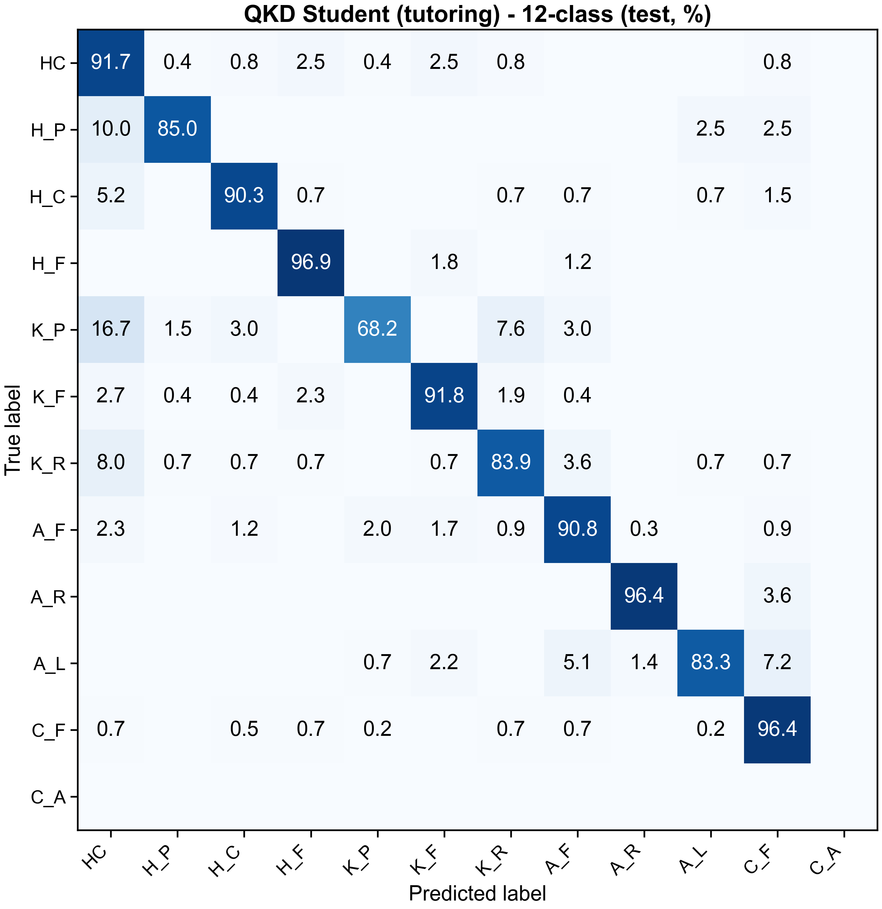

# Gait Classification with QKD

좌우 보행 시계열을 분류하는 Transformer teacher, 경량 FP32 student, Quantization-aware Knowledge Distillation(QKD), ONNX 배포 및 TIMING 설명 코드입니다. 기존 작업 폴더에서 논문용으로 필요한 소스와 일부 결과를 선별한 저장소입니다.

기존 `README.md`, `README_QKD.md`, `docs/`의 실행 안내를 현재 소스 기준으로 통합했습니다. Python 소스는 원본 그대로 복사했으며, 실제 import에 필요한 두 teacher 모델 파일도 함께 보존했습니다. 원시·가공 데이터와 학습 가중치는 포함하지 않습니다.

## 1. 저장소 구성

| 파일 / 경로 | 역할 |
| --- | --- |
| `model.py`, `model_teacher_original.py` | Teacher 모델. QKD 학습과 일부 추론 코드는 후자를 직접 import |
| `qkd_model.py`, `qkd_common.py` | Student, 학습 가능한 fake quantizer, 데이터 로딩·정규화·평가 |
| `train.py`, `train_student_fp.py`, `train_qkd.py` | Teacher → FP student → QKD 학습 |
| `inference.py` | 기본 teacher 체크포인트 평가 |
| `export_qkd_to_onnx.py`, `quantize_onnx_int8.py` | FP32 ONNX 내보내기 및 train calibration 기반 INT8 변환 |
| `export_qkd_qat_qdq.py`, `check.py` | 학습된 QAT scale을 보존하는 Q/DQ 내보내기와 노드 검사 |
| `evaluate_onnx.py`, `run_onnx_rpi.py` | ONNX 정확도 평가 및 PC/Pi 추론·벤치마크 |
| `timing.py`, `explain_timing.py`, `plot_timing_class_heatmaps.py` | TIMING attribution 계산 및 클래스별 시각화 |
| `plot_style.py`, `plot_figures.py` | 공통 그림 스타일, 혼동행렬·학습곡선 생성 |
| `pi_receive.py`, `export_normalization.py` | 선택 기능: ESP32 직렬 수신, 정규화 통계 내보내기 |
| `prepare_gait_nne.py` | 선택 기능: Unreal NNE용 teacher ONNX 내보내기·수치 검증 |
| `requirements_pc.txt`, `requirements_rpi.txt` | PC 학습·분석 / Pi 실행 의존성 |
| `deploy/labels.json` | 12개 클래스 인덱스와 레이블 대응 |
| `results/reference/output/` | 기존 실행의 요약·학습 기록·클래스 보고서·TIMING 메타데이터 |
| `figures/` | 선별한 혼동행렬·학습곡선 14개와 TIMING 요약 그림 2개 |
| `FILE_MANIFEST.csv` | 복사 파일의 원래 상대경로, 저장 위치, SHA-256 및 변경 여부 |

새 실행 결과는 `output/`, `checkpoints/`, `deploy/` 등에 생성됩니다. 기존 기록은 `results/reference/`에 분리해 두었습니다.

## 2. 실행 환경

Python 3.10 이상을 사용하고, 명령은 모두 이 저장소 루트에서 실행합니다.

```bash
python -m venv .venv
```

Windows PowerShell에서는 `.venv\Scripts\Activate.ps1`, Linux/macOS에서는 `source .venv/bin/activate`로 환경을 활성화합니다.

```bash
python -m pip install -r requirements_pc.txt
```

CUDA를 사용할 경우 실행 장비에 맞는 PyTorch 환경이 필요합니다. 현재 요구사항은 버전 잠금 파일이 아닙니다. TIMING 기본 색상맵을 위해 `matplotlib>=3.10`을 명시했습니다. Pi 직렬 수신 의존성인 `pyserial`은 `requirements_rpi.txt`에 포함했습니다.

## 3. 데이터 준비

다음 8개 파일을 별도로 준비합니다. 이 폴더에는 원시 데이터에서 아래 NPY를 만드는 완전한 전처리 파이프라인이 없어, 이 저장소만으로 원시 데이터부터 전체 실험을 재현할 수는 없습니다.

```text
processed_data/
├── X_left_train.npy
├── X_right_train.npy
├── X_left_test.npy
├── X_right_test.npy
├── y_left_train.npy
├── y_right_train.npy
├── y_left_test.npy
└── y_right_test.npy
```

- 입력 X: 좌우 각각 `[N, 5, T]` 또는 `[N, T, 5]`. 기존 실험과 배포 예시는 `T=101`이며, 학습 스크립트는 실제 데이터의 시간 길이로 모델의 `max_len`을 설정합니다.
- 레이블 y: 샘플별 문자열 클래스. 좌우 샘플 수·순서·레이블이 일치해야 합니다.
- 채널 순서는 기존 데이터와 동일하게 유지합니다. 채널의 물리적 의미나 단위를 이 저장소에서 새로 정의하지 않습니다.
- 12개 클래스 순서: `HC, H_P, H_C, H_F, K_P, K_F, K_R, A_F, A_R, A_L, C_F, C_A`.
- 기본 학습 코드의 5개 그룹 순서: `HC, H, K, A, C`. 12개 예측의 argmax를 상위 그룹으로 매핑해 5클래스 정확도를 계산합니다.

기본 학습은 seed 42, train 배열의 약 3%를 validation으로 사용하는 샘플 단위 분할입니다. 정규화 통계는 validation 분리 전 전체 train 배열에서 좌우별·채널별로 계산합니다. 피험자/세션 독립 분할을 수행한 코드로 해석해서는 안 됩니다. QKD는 FP student 체크포인트에 저장된 분할과 정규화 통계를 재사용합니다.

## 4. 학습 및 teacher 평가

```bash
python train.py
python train_student_fp.py
python train_qkd.py
```

세 학습 스크립트는 명령행 옵션 대신 파일 상단의 경로·하이퍼파라미터 상수를 사용합니다.

| 단계 | 기본 구성 | 주요 출력 |
| --- | --- | --- |
| Teacher | embedding 256, 8 heads, 4 layers, FFN 1024 | `checkpoints/best_model.pt`, `output/` |
| FP student | embedding 192, 6 heads, 4 layers, FFN 768 | `checkpoints/best_student_fp.pt`, `output/student_fp/` |
| QKD | W8A8, temperature 2, SS/CS/TU = 30/30/40 epochs | `best_student_ss.pt`, `best_qkd_cs.pt`, `best_student_qkd.pt` 및 `output/qkd/` |

QKD의 SS는 학생의 CE 학습, CS는 교사·학생의 상호 학습, TU는 교사를 고정한 학생 학습입니다. CS/TU의 학생 손실은 `CE + T² × KL`입니다. QKD 실행 전에 teacher와 FP student 체크포인트가 모두 필요합니다.

```bash
python inference.py --checkpoint checkpoints/best_model.pt --data-dir processed_data
```

`inference.py`의 기본 모델 평가 경로를 사용합니다. 이 저장소에서 제외한 Optuna 실험의 architecture v2 체크포인트는 지원 대상으로 안내하지 않습니다.

## 5. ONNX 내보내기 및 평가

### 5.1 FP32 내보내기 → calibration 기반 INT8

```bash
python export_qkd_to_onnx.py --checkpoint checkpoints/best_student_qkd.pt --output deploy/student_qkd_fp32.onnx
python quantize_onnx_int8.py --input deploy/student_qkd_fp32.onnx --output deploy/student_qkd_int8.onnx --processed-dir processed_data --normalization deploy/normalization.npz --calibration-samples 512
```

첫 명령은 모델과 함께 `deploy/normalization.npz`, `deploy/labels.json`을 생성합니다. 이 경로는 QKD master weight를 fake quantization 없이 내보낸 후, train 데이터만 사용해 INT8 scale을 다시 계산합니다. 선택적으로 `--calibration-method percentile --calibration-samples 1024`를 비교할 수 있습니다.

PC와 Raspberry Pi에서 동일한 CLI로 모델별 정확도와 추론 시간을 기록할 수 있습니다.

```bash
python run_onnx_rpi.py --model deploy/student_qkd_fp32.onnx --output output/fp32_results.json --predictions output/fp32_predictions.csv
python run_onnx_rpi.py --model deploy/student_qkd_int8.onnx --output output/int8_results.json --predictions output/int8_predictions.csv
```

기본 데이터 위치는 `processed_data/`, 정규화·레이블 위치는 `deploy/`입니다. `y_left_test.npy`가 있으면 정확도를 평가하고, 없으면 예측만 저장합니다. `--index 0`은 단일 샘플 실행입니다. `--threads 1`, `2`, `4`를 각각 측정해 비교할 수 있습니다.

`evaluate_onnx.py`도 사용할 수 있지만 **CLI 옵션이 없습니다**. 상단 `MODEL_PATH`, `NORMALIZATION_PATH`, `LABELS_PATH`, `OUTPUT_PATH` 등을 설정한 뒤 아래와 같이 실행합니다. 기존 문서의 `evaluate_onnx.py --model ... --output ...` 예시는 현재 코드에 적용되지 않습니다.

```bash
python evaluate_onnx.py
```

### 5.2 학습된 QAT scale을 보존하는 별도 경로

```bash
python export_qkd_qat_qdq.py --checkpoint checkpoints/best_student_qkd.pt --output deploy/student_qkd_qat_qdq.onnx
python check.py
```

QAT exporter의 기본 출력은 `deploy/student_qkd_qat_qdq.onnx`입니다. 위 명령은 비교할 모델을 구분하기 위해 경로를 명시했습니다. `check.py`는 이 경로의 ONNX 구조와 QuantizeLinear/DequantizeLinear 노드를 검사합니다.

PyTorch fake quantization은 부동소수점 실행입니다. Q/DQ 노드가 있는 ONNX도 전체 연산이 INT8 커널로 실행되거나 속도가 개선된다는 뜻은 아닙니다. 모델별 정확도와 배포 장비에서의 실행 시간을 별도로 측정해야 합니다. 기록되는 latency는 주로 모델 실행 구간이며 데이터 로딩·저장까지 포함한 전체 처리 시간이 아닙니다. RSS는 프로세스 메모리입니다.

## 6. Raspberry Pi 및 선택 배포 기능

Pi의 같은 폴더에 다음 파일을 배치합니다.

```text
run_onnx_rpi.py, requirements_rpi.txt
student_qkd_int8.onnx, normalization.npz, labels.json
X_left_test.npy, X_right_test.npy
y_left_test.npy  (정확도 평가 시)
```

Pi의 Python 환경에서 실행합니다.

```bash
python -m pip install -r requirements_rpi.txt
python run_onnx_rpi.py --threads 2
```

전체 데이터 예측은 `onnx_dataset_predictions.csv`, 요약·평가·batch-1 벤치마크는 `onnx_dataset_results.json`에 저장됩니다. 실제 실행 장비의 OS·Python·ONNX Runtime 버전, 스레드 수와 전원 설정을 실험 기록에 함께 남깁니다.

`pi_receive.py`는 ESP32 패킷 수신용 선택 기능입니다. 상단 `SERIAL_PORT`와 `USE_MODEL_INFERENCE` 등을 설정하며, 기본값은 모델 추론을 끈 수신 모드입니다. 추론을 켜면 스크립트와 같은 폴더의 모델과 정규화 파일을 사용합니다. ESP32 송신 펌웨어는 포함되어 있지 않습니다.

`export_normalization.py`는 train 배열에서 정규화 통계를 다시 만듭니다. 모델에 맞는 통계를 사용해야 하므로 일반 QKD 배포에는 ONNX exporter가 생성한 정규화 파일을 사용합니다.

```bash
python prepare_gait_nne.py --output ue_export
```

이 선택 명령은 teacher용 Unreal NNE 내보내기입니다. QKD 배포와 별도 경로이며, 정규화를 그래프에 포함하므로 입력을 중복 정규화하지 않습니다. Unreal 프로젝트 자체는 포함하지 않습니다.

## 7. TIMING 설명과 그림 생성

```bash
python explain_timing.py --max-samples 32 --output-dir output/timing_example
python plot_timing_class_heatmaps.py --input-dir output/timing_example
```

위 명령은 소규모 실행 예시입니다. 전체 test set에는 `--max-samples 0`을 사용합니다. 기본 타깃은 정답 클래스이고, `--target-mode predicted`로 예측 클래스, `--class-level 5`로 상위 그룹 확률을 설명할 수 있습니다. 5클래스 설명은 세부 클래스 확률의 합을 대상으로 하므로 fine argmax를 매핑하는 5클래스 정확도와 구분합니다.

TIMING baseline은 정규화된 입력의 0입니다. 계산에는 여러 forward/backward pass가 필요합니다. 기본 색상은 `default`, `cividis`, `managua`이며 `--color-scheme cividis`처럼 선택할 수 있습니다. Attribution은 모델 동작에 대한 설명으로 해석합니다.

```bash
python plot_figures.py
```

이 명령은 학습된 체크포인트와 test 데이터를 사용해 혼동행렬을 다시 계산하고, `output/history.json`, `output/student_fp/history.json`, `output/qkd/history.json`에서 학습곡선을 그립니다. 새 학습 후 실행하는 것이 기본 경로입니다. 기존 기록을 사용할 때는 `results/reference/output/`의 세 `history.json`을 각각 해당 `output/` 위치로 복사하고, 그 실행에 대응하는 체크포인트·데이터도 별도로 준비해야 합니다. 기존 파일이 있으면 덮어쓰지 말고 사용할 실행 기록을 먼저 선택합니다.

TIMING 그림을 다시 계산하려면 `explain_timing.py`가 생성하는 attribution 배열이 필요합니다. 저장소에 포함한 요약 CSV/JSON만으로는 재계산할 수 없습니다. 선별한 TIMING 그림의 색상 범위는 [메타데이터](results/reference/output/timing_12cls_ground_truth/class_heatmaps_target/class_heatmap_metadata.json)에 있습니다.

## 8. 포함한 기존 결과

아래 값은 복사된 기존 실행 기록이며, 저장소 정리 과정에서 재학습·성능 재검증을 수행한 결과가 아닙니다.

| 기록 | 12클래스 test accuracy | 5클래스 test accuracy | 출처 |
| --- | ---: | ---: | --- |
| Teacher | 90.3210% | 해당 요약에 없음 | [summary](results/reference/output/summary.json) |
| FP student | 90.5717% | 91.6750% | [summary](results/reference/output/student_fp/summary.json) |
| QKD TU | 90.9729% | 92.0762% | [summary](results/reference/output/qkd/summary.json) |

기존 test 기록은 1,994개 샘플이며 `C_A`의 test support는 0입니다. 출력은 12클래스이지만 모든 클래스의 test 성능이 검증된 결과로 해석할 수는 없습니다. 클래스별 보고서를 함께 확인합니다.

학습곡선·혼동행렬 PNG는 기존 그림을 선별해 복사했습니다. 원본 기록에 모델 해시와 완전한 실행 환경이 없어, 그림과 체크포인트의 대응을 이번 정리에서 다시 검증하지는 않았습니다. JSON 내부의 `checkpoint`·`output_dir` 값은 원래 실행의 상대경로입니다.



## 9. 포함·제외 기준과 재현 범위

| 대상 | 처리 이유 |
| --- | --- |
| 데이터, 세션/시행 식별 배열, 샘플별 예측·attribution | 별도 준비하는 실험 입력·대량 산출물이므로 제외 |
| `.pt`, `.onnx`, `.npz`, Optuna DB | 가중치·생성 파일은 제외하고 생성 방법을 문서화 |
| `*_save/`, `save/`, `RaspberryPi/`, `raspberrypi_test_default/` | 백업·중복·구버전 배포 파일 제외 |
| `train_optuna.py` | 현재 `model.py`에 없는 생성자 인자·출력 구조를 요구하여 제외 |
| `QKD/` | 빈 `__init__.py`뿐이며 import 의존성이 없어 제외 |
| 기존 `docs/`, README 여러 개 | 실행에 필요한 내용을 이 README로 통합 |
| `outputs/`, 발표 자료, 결과 정리 DOCX, 임시 작업·IDE·캐시 | 외부 프로젝트 의존 그림, 문서 조각, 작업 자료와 생성물을 제외 |
| 기존 ONNX 평가 JSON | 동일 모델 경로에 서로 다른 수치가 있고 실행 이력을 구분할 근거가 없어 제외. 내보내기 후 재평가 필요 |

`.gitignore`는 데이터·가중치·신규 실행 산출물의 실수 업로드를 막고, 선별한 `figures/`와 `results/reference/`는 추적 가능하게 둡니다. [FILE_MANIFEST.csv](FILE_MANIFEST.csv)는 복사 시점의 파일 해시를 기록하며, 새로 작성한 README·Git 설정 파일 및 manifest 자체는 대상에 포함하지 않습니다. 요구사항 파일 2개의 변경은 manifest에 별도로 표시했습니다.

이 폴더에는 확정된 논문 제목·저자·DOI·코드 라이선스 정보가 없어 임의의 인용문이나 라이선스를 추가하지 않았습니다. 원본 데이터의 배포 조건도 이 저장소에서 정하지 않습니다.
